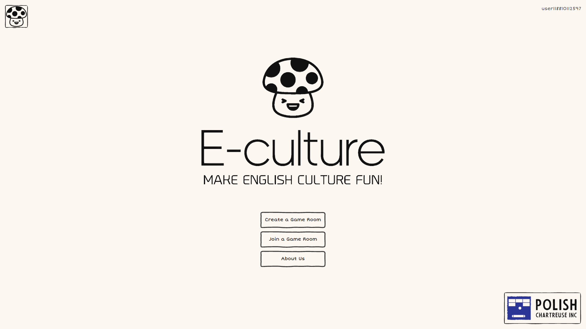
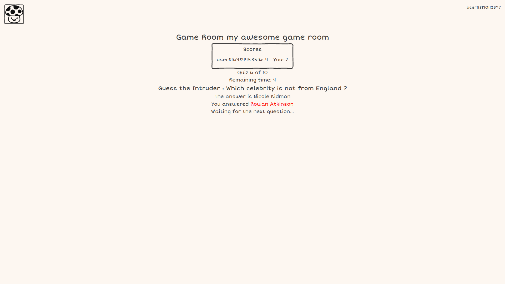

[e-culture](https://le-chartreux.github.io/e-culture/) is an educational website to learn about english culture by quizzes.
It's multiplayer: have fun with your friends!

## Table of contents

<!-- TOC -->
  * [Table of contents](#table-of-contents)
  * [User documentation](#user-documentation)
    * [Home page](#home-page)
    * [Create a Game Room](#create-a-game-room)
    * [Join a Game Room](#join-a-game-room)
    * [Game Room](#game-room)
      * [Before the start](#before-the-start)
      * [In game](#in-game)
    * [About us](#about-us)
  * [Development](#development)
<!-- TOC -->

## User documentation

### Home page

To access the e-culture's home page, click [here](https://le-chartreux.github.io/e-culture/). It leads you to the following page, where you can select between [Create a Game Room](#create-a-game-room), [Join a Game Room](#join-a-game-room) and [About Us](#about-us).

### Create a Game Room

If you want to play within a private game room, you first have to create it. Enter an ID for your game room, then press `Create Game Room 'the game room ID'`. It will redirect you [inside your newly created game room](#game-room).

### Join a Game Room

To join a game room, you can either join a random game room or a game room from an ID (if a friend of yours gives you the one of its game room). Joining a game room will redirect you [inside the game room](#game-room).

### Game Room

#### Before the start

If the game hasn't started yet, a button start game will appear if you are the owner of the game room (its creator). Else you will have to wait for the owner to start the game.

#### In game

Once the game started, you will be prompted a succession of 10 quizzes, with a time limit of 10 seconds per quiz.

By clicking an answer, the correct answer will be displayed. If your given answer matches, you will gain one point on your score.

At the end of the 10 questions, a game ended page will appear, with the scores. The owner of the game will be able to restart it if he wants.

### About us

## Development

Check [CONTRIBUTING.md](CONTRIBUTING.md) for information about the development of the application.
